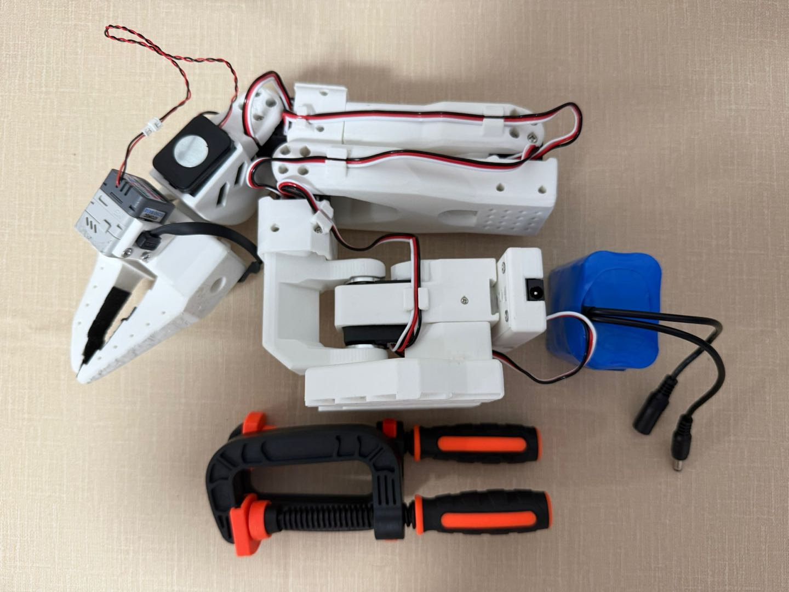
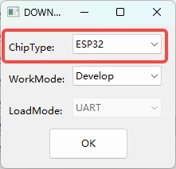
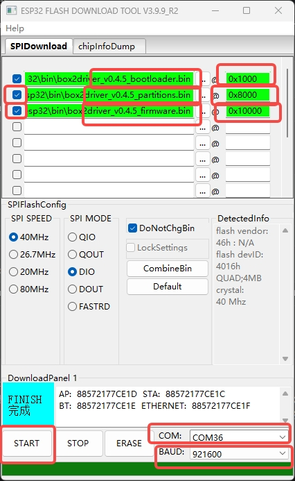
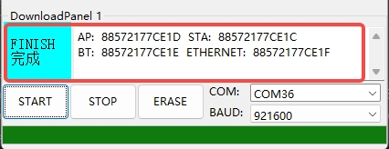

[English](README_en.md) | 中文

# Box2Robot — 具身智能云平台

**即插即用的机械臂，云端训练、技能共享、AI 智能体控制。**

<div align="center">
  
</div>

Box2Robot 是一个开源具身智能平台。将 ESP32 机械臂和视觉模块连接到云端平台，实现数据采集、模型训练和技能共享。无需复杂配置 —— 烧录固件、连 WiFi、绑定设备，即可开始。

> **当前版本：v0.6.1**

## 快速开始

### 1. 获取硬件

<div align="center">
  <a href="https://item.taobao.com/item.htm?abbucket=5&id=1030962099420">
    
  </a>
  <br>
  <a href="https://item.taobao.com/item.htm?abbucket=5&id=1030962099420">购买 Box2AI 机械臂套件 (淘宝)</a>
</div>

组装机械臂并将舵机连接到驱动板。固件已预装，如需手动烧录请参阅 [烧录固件](#烧录固件)。

### 2. 连接设备热点

给设备上电，设备会创建 WiFi 热点：
- **机械臂驱动板：** `Box2Robot_XXXX` (XXXX 为 MAC 后 4 位)
- **视觉语音模块：** `Box2Cam_XXXX`

用手机或电脑连接该热点。会自动弹出配网页面（如未弹出，手动访问 `192.168.4.1`）。

### 3. 配置 WiFi

在配网页面输入 WiFi 名称和密码。设备会保存凭据、重启并连接到你的网络。

### 4. 绑定设备

设备连上 WiFi 后，获取 **6 位绑定码**：
- **机械臂：** 显示在 OLED 屏幕上
- **摄像头：** 通过 TTS 语音播报

然后：
1. 访问 [**https://robot.box2ai.com**](https://robot.box2ai.com/#/)
2. 注册账号
3. 进入 **设备管理 → 绑定设备**
4. 输入 6 位绑定码
5. 完成！

绑定后即可使用全部功能：远程遥控、校准、数据采集、云端训练、技能商店、语音交互。

---

## AI 智能体控制 (Skills CLI)

通过 **Claude Code**、**GPT** 等 AI 智能体，使用 `box2robot_skills/` CLI 控制机械臂。

### 快速开始

```bash
cd box2robot_skills

# 登录 (token 缓存，后续免登录)
python b2r.py login <username> <password>

# 操控
python b2r.py devices                # 查看设备
python b2r.py home                   # 回零位
python b2r.py move 1 2048 500        # 1号舵机转到2048
python b2r.py torque off             # 释放力矩
python b2r.py record start           # 开始录制
python b2r.py record stop            # 停止录制
python b2r.py play                   # 列出并播放轨迹
python b2r.py say "拍个照"            # 自然语言指令
python b2r.py shell                  # 交互式 Shell
```

### 配合 Claude Code 使用

```
"读一下 box2robot_skills/SKILLS.md，然后把1号舵机转到2048"
"录一段轨迹，录完后播放一遍"
"查看舵机状态，然后回零位"
```

详见 `box2robot_skills/SKILLS.md`（AI 智能体调度手册，79 个 Action、预检规则、工作流模板）。

---

## 烧录固件

预编译固件在 `bin/` 目录下，两个设备需要分别烧录：

### USB 驱动

如果电脑无法识别 USB 端口，请安装 `bin/download_driver_CP210x_USB_TO_UART/` 中的 CP210x 驱动。

### 方法一：esptool (跨平台)

```bash
pip install esptool
```

**机械臂驱动板 (ESP32)：**

```bash
python -m esptool --chip esp32 erase_flash

python -m esptool --chip esp32 --baud 921600 write_flash  0x1000  bin/box2robot_arm/box2arm_v0.6.1_bootloader.bin  0x8000  bin/box2robot_arm/box2arm_v0.6.1_partitions.bin  0x10000 bin/box2robot_arm/box2arm_v0.6.1_firmware.bin
```

**视觉语音模块 (ESP32-S3)：**

```bash
python -m esptool --chip esp32s3 erase_flash

python -m esptool --chip esp32s3 --baud 921600 write_flash  0x0 bin/box2robot_cam/box2cam_v0.6.1_bootloader.bin  0x8000  bin/box2robot_cam/box2cam_v0.6.1_partitions.bin 0x10000 bin/box2robot_cam/box2cam_v0.6.1_firmware.bin
```

> esptool 会自动检测串口。如果连接了多个设备，可用 `--port COM5` 手动指定。

### 方法二：Flash Download Tool (Windows 图形工具)

使用 `bin/flash_download_tool_windows/flash_download_tool_3.9.9_R2.exe`。

1. 选择芯片类型（机械臂选 **ESP32**，摄像头选 **ESP32-S3**），WorkMode: Develop，LoadMode: UART：

   

2. 添加 3 个 bin 文件及地址（机械臂: 0x1000/0x8000/0x10000，摄像头: 0x0/0x8000/0x10000），选择 COM 端口，波特率 921600，点击 **START**：

   

3. 等待 **FINISH**：

   

---

## 更新日志

| 版本 | 日期 | 说明 |
|------|------|------|
| v0.6.1 | 2026-04-19 | GPU 训练推理节点开源，修复幻尔舵机校准偏置写入，新增舵机电压范围选择 (5V/7.4V/12V)，WiFi 主从遥操流畅度优化 |
| v0.5.1 | 2026-04-14 | 云端平台集成、WebSocket 中继、OTA、ESP-NOW 50Hz 双通道、摄像头 MJPEG+ADPCM 音频、语音 AI 链路、自动校准、数据采集对齐 |
| v0.4.5 | 2026-03-23 | (LeRobot-ESP32) 幻尔 LX 舵机支持、自动检测舵机类型 |

## 相关链接

- **云端平台：** [https://robot.box2ai.com](https://robot.box2ai.com/#/)
- **硬件购买：** [淘宝店铺](https://item.taobao.com/item.htm?abbucket=5&id=1030962099420)
- **前代项目 (纯 ESP-NOW)：** [LeRobot-ESP32](https://github.com/box2ai-robotics/lerobot-esp32)
- **LeRobot 框架：** [Hugging Face LeRobot](https://github.com/huggingface/lerobot)

## 开源协议

Apache 2.0 License

---

如果这个项目对你有帮助，请给个 Star！
