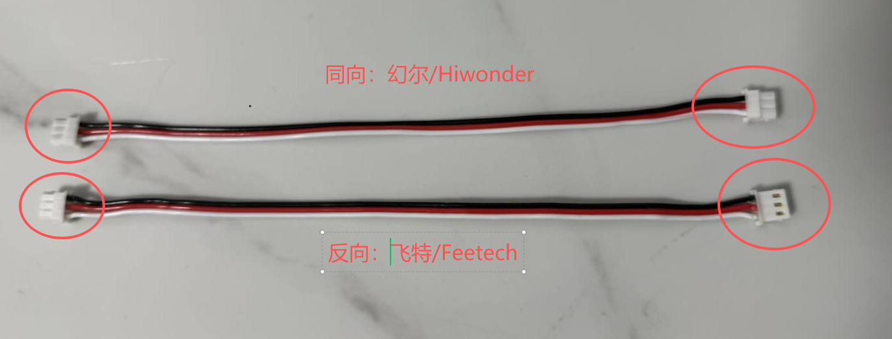

English | [中文](README_zh.md)

# Box2Robot: The First Embodied AI Cloud Platform

**Cloud-based data collection, training, and inference — with massive shared resources and a skill library.**

Box2Robot is an open-source embodied AI platform built around ESP32-powered robot arms and vision modules. It provides a complete pipeline from hardware to cloud: plug in your device, connect to the platform, and start collecting data, training models, or deploying shared skills — all from a mobile app or web interface.

> **Current Release (v0.5.1):** Arm Driver Board firmware + Vision-Audio Module firmware are open-sourced. Cloud platform, GPU Worker, and Audio Node will be released progressively.

## Quick Start

**5 steps from unboxing to full control:**

### Step 1: Get the Hardware

<div align="center">
  <a href="https://item.taobao.com/item.htm?abbucket=5&id=1030962099420">
    
  </a>
  <br>
  <a href="https://item.taobao.com/item.htm?abbucket=5&id=1030962099420">Purchase the Box2AI Robot Arm Kit (Taobao)</a>
</div>

Assemble the robot arm and connect servos to the driver board. If the firmware is not pre-flashed, see [Flash Firmware](#flash-firmware) below.

### Step 2: Connect to Device Hotspot

Power on the device. It will create a WiFi hotspot:
- **Arm Driver Board:** `Box2Robot_XXXX` (XXXX = last 4 digits of MAC)
- **Vision-Audio Module:** `Box2Cam_XXXX`

Connect your phone/PC to this hotspot. A captive portal will open automatically (or navigate to `192.168.4.1`).

### Step 3: Configure Your WiFi

In the captive portal page, enter your home/office WiFi name and password. The device will save the credentials, reboot, and connect to your WiFi network.

### Step 4: Register & Bind on Platform

Once connected to WiFi, the device registers with the cloud platform and receives a **6-digit binding code**:
- **Arm Driver Board:** Displayed on the OLED screen
- **Vision-Audio Module:** Announced via TTS voice

Now open the platform:

1. Visit [**https://robot.box2ai.com**](https://robot.box2ai.com/#/) on your phone or PC
2. Register an account (SMS verification)
3. Go to **Device Management → Bind Device**
4. Enter the 6-digit binding code shown on OLED / announced by voice
5. Done! The device is now bound to your account

### Step 5: Start Using

Once bound, you have full access to all platform features:
- **Remote Control** — Joystick control from the app
- **Calibration** — Auto-calibrate servo limits or manual center offset
- **Data Collection** — Leader-Follower ESP-NOW dual-arm recording with camera sync
- **Cloud Training** — Submit training jobs, monitor progress, deploy models
- **Skill Store** — Browse and execute shared ACT skills from the community
- **Voice Interaction** — Talk to your robot arm via the Vision-Audio Module

## What's Open-Sourced Now

| Module | Status | Description |
|--------|--------|-------------|
| **Arm Driver Board Firmware** | Open | ESP32 servo driver, ESP-NOW sync, WiFi+WS, calibration, OTA |
| **Vision-Audio Module Firmware** | Open | ESP32-S3 camera (OV3660) + audio (ES8311), MJPEG stream, ADPCM voice |
| **Flash Tools & Drivers** | Open | esptool, Flash Download Tool (Windows GUI), CP210x USB driver |
| Cloud Platform (Server + App) | Coming soon | aiohttp backend + Vue3 UniApp frontend |
| GPU Worker (Training & Inference) | Coming soon | LeRobot ACT framework, cloud training pipeline |
| Audio Node (Voice AI) | Coming soon | FunASR + LLM + TTS, voice-controlled robot arm |

## System Architecture

```
┌─────────────────────────────────────────────────────────────┐
│  Cloud Platform: robot.box2ai.com                           │
│  ├── User App (H5/Mobile)                                   │
│  ├── ACT Skill Store (shared skills & models)               │
│  ├── Cloud Training (submit job → GPU train → deploy)       │
│  └── WebSocket Relay (real-time device control)             │
├─────────────────────────────────────────────────────────────┤
│  GPU Nodes (scalable, plug-and-play)                        │
│  ├── Training Worker (LeRobot ACT, data → model)            │
│  └── Inference Server (model → 20Hz real-time control)      │
├─────────────────────────────────────────────────────────────┤
│  Audio Nodes (scalable, plug-and-play)                      │
│  ├── ASR Engine (FunASR SenseVoice, speech → text)          │
│  ├── LLM Chat (GLM-4 + robot arm tools)                    │
│  └── TTS Engine (edge-tts, text → speech)                   │
├─────────────────────────────────────────────────────────────┤
│  Devices (standardized hardware)                            │
│  ├── Arm Driver Board (ESP32, 6-DOF servo control)          │
│  │   └── ESP-NOW: Leader↔Follower 50Hz (<3ms latency)      │
│  └── Vision-Audio Module (ESP32-S3, camera + mic + speaker) │
│      └── MJPEG stream + ADPCM audio over WebSocket          │
└─────────────────────────────────────────────────────────────┘
```

### Design Principles

- **GPU Nodes are scalable:** Any machine with a GPU can register as a training/inference worker — the platform dispatches jobs automatically.
- **Audio Nodes are scalable:** Any machine with a GPU can register as a voice processing node — ASR, LLM reasoning, and TTS run independently from the devices.
- **Devices are standardized:** The Arm Driver Board and Vision-Audio Module use a unified protocol. Plug in, connect WiFi, bind on the platform, and you're ready.

## Hardware Details

### Arm Driver Board (ESP32)

**Schematic:**


- **MCU:** ESP32-WROOM-32 (4MB Flash, no Bluetooth — saves RAM for WiFi+ESP-NOW)
- **Servo Bus:** UART 1Mbps, supports Feetech SC/ST series + Hiwonder LX series
- **Connectivity:** WiFi (WebSocket to cloud) + ESP-NOW (Leader↔Follower 50Hz direct sync)
- **Display:** SSD1306 OLED (128x64, binding code display)
- **LED:** WS2812 RGB x2 (mode + status indicators)
- **Features:** Auto-calibration, OTA update, trajectory record/playback, Go Home

### Vision-Audio Module (ESP32-S3)

<div align="center">
  
  <br>
  Box2AI Vision-Audio Module (purchase link coming soon)
</div>

**Block Diagram:**

```
┌───────────────────────────────────────┐
│       AtomS3R-M12 Controller          │
│  ┌─────────┐ ┌──────┐ ┌──────────┐  │
│  │ OV3660  │ │BMI270│ │ 0.85"IPS │  │
│  │ 3MP M12 │ │6-axis│ │ Display  │  │
│  │ Camera  │ │ IMU  │ │          │  │
│  └─────────┘ └──────┘ └──────────┘  │
│       ESP32-S3-PICO (8MB+8MB)        │
│          WiFi + BLE 5.0              │
└──────────────┬───────────────────────┘
               │ Stack connector
┌──────────────┴───────────────────────┐
│       Atomic Echo Base                │
│  ┌─────────┐  ┌──────────────────┐  │
│  │ ES8311  │  │ NS4150B Class-D  │  │
│  │ 24-bit  │  │ 1W Amplifier     │  │
│  │ Codec   │  │    ↓             │  │
│  └────┬────┘  │ 1W 8Ω Speaker   │  │
│  ┌────┴────┐  └──────────────────┘  │
│  │MEMS Mic │                         │
│  └─────────┘                         │
└───────────────────────────────────────┘
```

- **MCU:** ESP32-S3-PICO-1-N8R8 (8MB Flash + 8MB PSRAM, Dual LX7 @ 240MHz)
- **Camera:** OV3660 3MP, M12 120° wide-angle lens, VGA JPEG default (5 resolution levels: QQVGA/QVGA/VGA/SVGA/XGA)
- **Audio Codec:** ES8311 24-bit (I2C 0x18), MEMS microphone + NS4150B Class-D 1W amplifier + speaker
- **Connectivity:** WiFi (WebSocket dual-channel: JPEG stream + ADPCM audio)
- **Size:** 24 x 24 x ~32 mm (controller + echo base stacked)
- **Features:** MJPEG streaming, voice capture & playback, TTS voice guidance, ESP-NOW WiFi sharing, OTA update

### Servo Cable Wiring — Feetech vs Hiwonder

The firmware auto-detects servo type on boot, but **the two brands use different cable orientations**:



| Brand | Connector Orientation | Description |
|-------|----------------------|-------------|
| **Hiwonder (幻尔)** | Same direction | Both connectors face the same way |
| **Feetech (飞特)** | Reversed | Connectors face opposite directions |

> **Warning:** Using the wrong cable orientation may damage your servos or controller board. Always verify before connecting.

## Flash Firmware

Pre-built firmware binaries are in the `bin/` directory. Two devices need separate flashing:

| Device | Chip | Firmware Directory |
|--------|------|--------------------|
| Arm Driver Board | ESP32 | `bin/box2robot_arm/` |
| Vision-Audio Module | ESP32-S3 | `bin/box2robot_cam/` |

### USB Driver

If your PC does not recognize the ESP32's USB port, install the CP210x driver from `bin/download_driver_CP210x_USB_TO_UART/`:

| Windows Version | Driver Folder |
|-----------------|---------------|
| Windows 10/11 | `CP210x_WIN10/` |
| Windows 7/8 (64-bit) | `CP210x_WIN7_WIN8 64/` |
| Windows XP / Win7 (32-bit) | `CP210x_XP_WIN7_32/` |

Run the installer, then reconnect the ESP32. The device should appear as a COM port in Device Manager.

### Find Your Serial Port

Connect the ESP32 to your PC via USB, then find the assigned serial port:

| Platform | Command | Example Output |
|----------|---------|----------------|
| **Windows** (PowerShell) | `Get-CimInstance Win32_SerialPort \| Select Name, DeviceID` | `COM5` |
| **Windows** (CMD) | `mode` | `COM5` |
| **macOS** | `ls /dev/cu.usb*` | `/dev/cu.usbserial-0001` |
| **Linux** | `ls /dev/ttyUSB* /dev/ttyACM*` | `/dev/ttyUSB0` |

> **Tip:** On Windows, check **Device Manager → Ports (COM & LPT)** for the port name.

### Method 1: Python esptool (Cross-Platform)

```bash
pip install esptool
```

#### Flash Arm Driver Board (ESP32)

All 3 files are required (bootloader + partition table + firmware):

| File | Address | Description |
|------|---------|-------------|
| `box2arm_v0.5.1_bootloader.bin` | `0x1000` | Bootloader |
| `box2arm_v0.5.1_partitions.bin` | `0x8000` | Partition table |
| `box2arm_v0.5.1_firmware.bin` | `0x10000` | Application firmware |

```bash
# Erase flash (clears WiFi & binding data — required for first flash)
python -m esptool --chip esp32 --port COM5 erase_flash

# Flash all 3 binaries
python -m esptool --chip esp32 --port COM5 --baud 921600 write_flash \
  0x1000  bin/box2robot_arm/box2arm_v0.5.1_bootloader.bin \
  0x8000  bin/box2robot_arm/box2arm_v0.5.1_partitions.bin \
  0x10000 bin/box2robot_arm/box2arm_v0.5.1_firmware.bin
```

#### Flash Vision-Audio Module (ESP32-S3)

> **Note:** ESP32-S3 uses a different bootloader address (`0x0`) than ESP32 (`0x1000`).

| File | Address | Description |
|------|---------|-------------|
| `box2cam_v0.5.1_bootloader.bin` | `0x0` | Bootloader |
| `box2cam_v0.5.1_partitions.bin` | `0x8000` | Partition table |
| `box2cam_v0.5.1_firmware.bin` | `0x10000` | Application firmware |

```bash
# Erase flash
python -m esptool --chip esp32s3 --port COM6 erase_flash

# Flash all 3 binaries
python -m esptool --chip esp32s3 --port COM6 --baud 921600 write_flash \
  0x0     bin/box2robot_cam/box2cam_v0.5.1_bootloader.bin \
  0x8000  bin/box2robot_cam/box2cam_v0.5.1_partitions.bin \
  0x10000 bin/box2robot_cam/box2cam_v0.5.1_firmware.bin
```

> Replace `COM5` / `COM6` with your actual port. On macOS/Linux, use `/dev/ttyUSB0` or `/dev/cu.usbserial-0001`.

### Method 2: Flash Download Tool (Windows GUI)

Use the graphical tool at `bin/flash_download_tool_windows/flash_download_tool_3.9.9_R2.exe`.

1. Open the tool. For **Arm Driver Board**, select **ChipType: ESP32**; for **Vision-Audio Module**, select **ChipType: ESP32-S3**. Set **WorkMode: Develop**, **LoadMode: UART**, click OK:

   

2. Add the 3 bin files with their addresses (see tables above), select your COM port and baud rate `921600`, then click **START**:

   

3. Wait until the status shows **FINISH**:

   

## Directory Structure

```
box2robot/
├── assets/                                  # Images and documentation assets
│   ├── hardware.jpg                         # Arm Driver Board photo
│   ├── hardware_SchDoc.png                  # Arm Driver Board schematic
│   ├── hardware_cam.jpg                      # Vision-Audio Module photo
│   ├── Hiwonder-feetech.png                # Servo cable orientation
│   ├── flash_esp32.jpg                      # Flash tool: chip selection
│   ├── flash_select_bins.jpg                # Flash tool: bin file selection
│   └── flahs_succesful.jpg                  # Flash tool: success screen
├── bin/
│   ├── box2robot_arm/                       # Arm Driver Board firmware (v0.5.1)
│   │   ├── box2arm_v0.5.1_bootloader.bin    # Bootloader (ESP32, addr: 0x1000)
│   │   ├── box2arm_v0.5.1_partitions.bin    # Partition table (addr: 0x8000)
│   │   └── box2arm_v0.5.1_firmware.bin      # Application (addr: 0x10000)
│   ├── box2robot_cam/                       # Vision-Audio Module firmware (v0.5.1)
│   │   ├── box2cam_v0.5.1_bootloader.bin    # Bootloader (ESP32-S3, addr: 0x0)
│   │   ├── box2cam_v0.5.1_partitions.bin    # Partition table (addr: 0x8000)
│   │   └── box2cam_v0.5.1_firmware.bin      # Application (addr: 0x10000)
│   ├── flash_download_tool_windows/         # Espressif Flash Download Tool (Windows)
│   └── download_driver_CP210x_USB_TO_UART/  # USB-to-UART driver (Windows)
├── box2robot_dashboard/                     # (Coming soon) LAN Dashboard
├── box2robot_gpu_worker/                    # (Coming soon) Training & Inference
├── box2roboy_audio/                         # (Coming soon) Voice AI Node
└── README.md                                # This file
```

## Changelog

| Version | Date | Notes |
|---------|------|-------|
| v0.5.1 | 2026-04-14 | Cloud platform integration, WebSocket relay, OTA, ESP-NOW 50Hz dual-channel, camera MJPEG+ADPCM audio, voice AI pipeline, auto-calibration, data collection alignment |
| v0.4.5 | 2026-03-23 | (LeRobot-ESP32) Hiwonder LX servo support, auto-detect servo type |

## Links

- **Cloud Platform:** [https://robot.box2ai.com](https://robot.box2ai.com/#/)
- **Hardware Purchase:** [Taobao Store](https://item.taobao.com/item.htm?abbucket=5&id=1030962099420)
- **Previous Project (ESP-NOW only):** [LeRobot-ESP32](https://github.com/box2ai-robotics/lerobot-esp32)
- **LeRobot Framework:** [Hugging Face LeRobot](https://github.com/huggingface/lerobot)

## License

Apache 2.0 License

---

If this project helps you, please give it a star!
