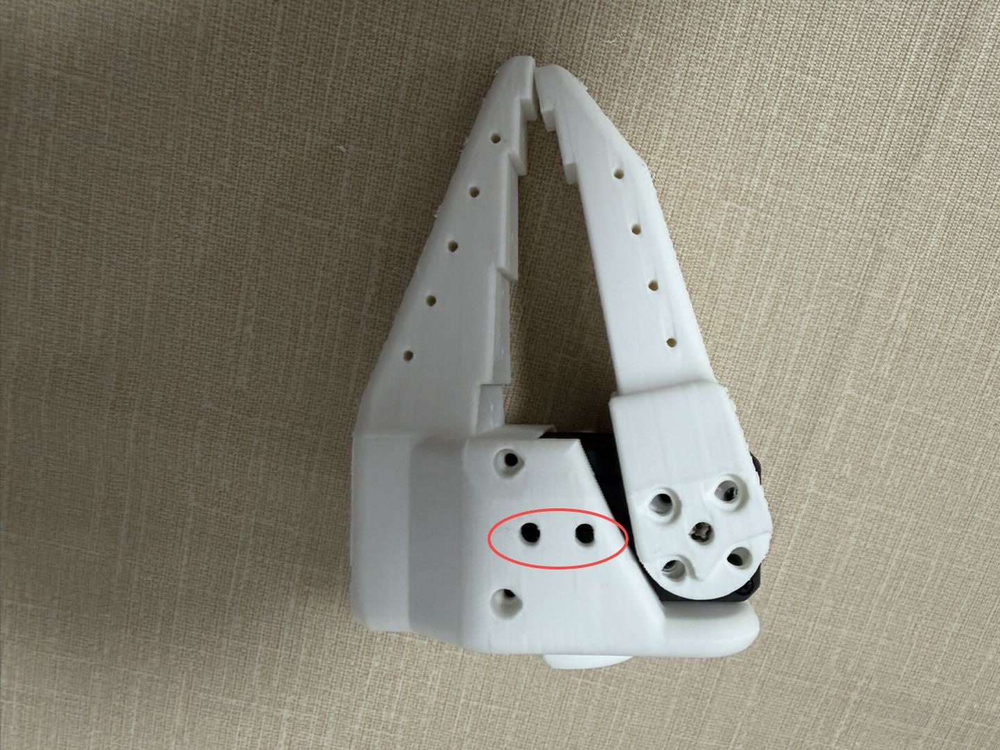
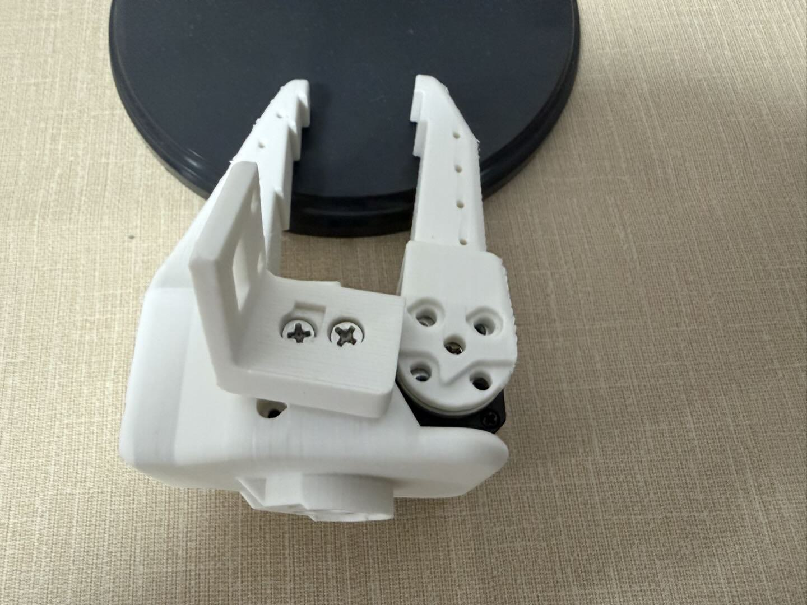
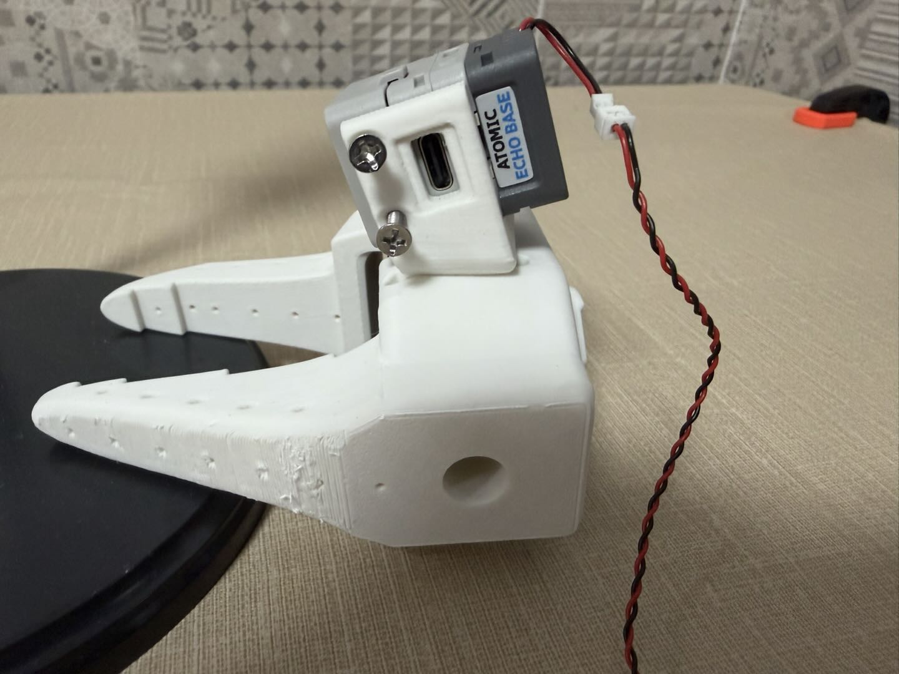
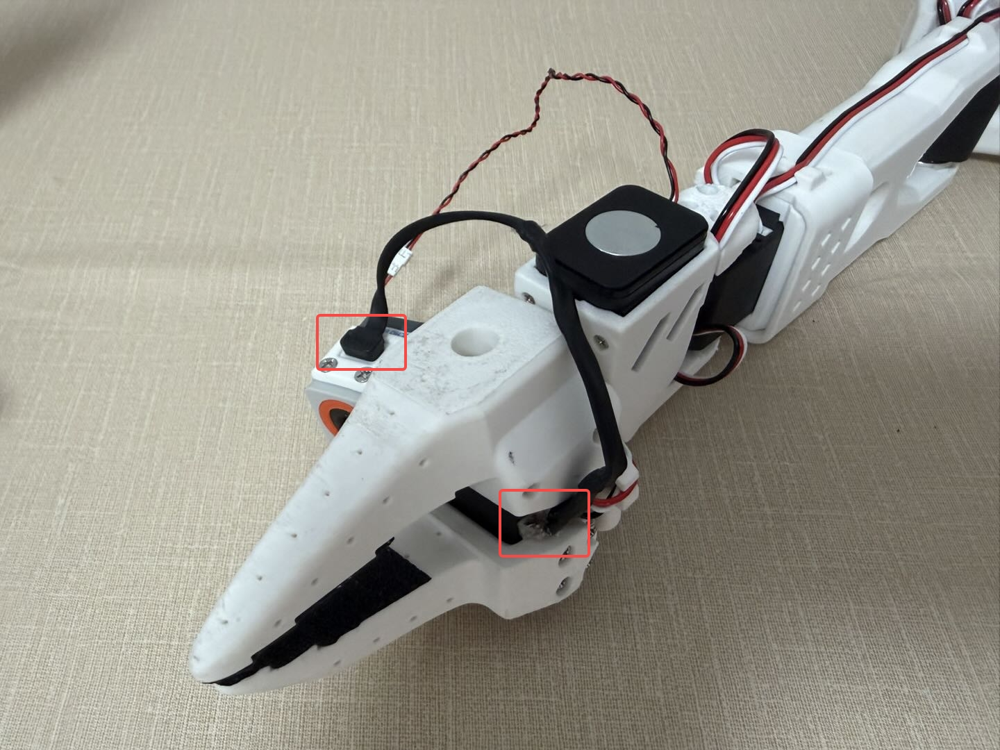
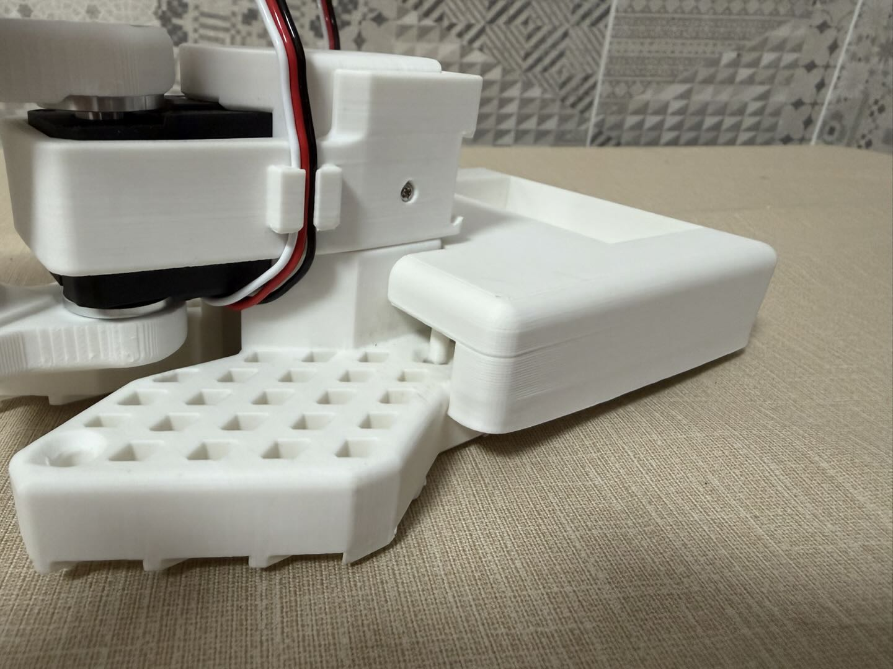
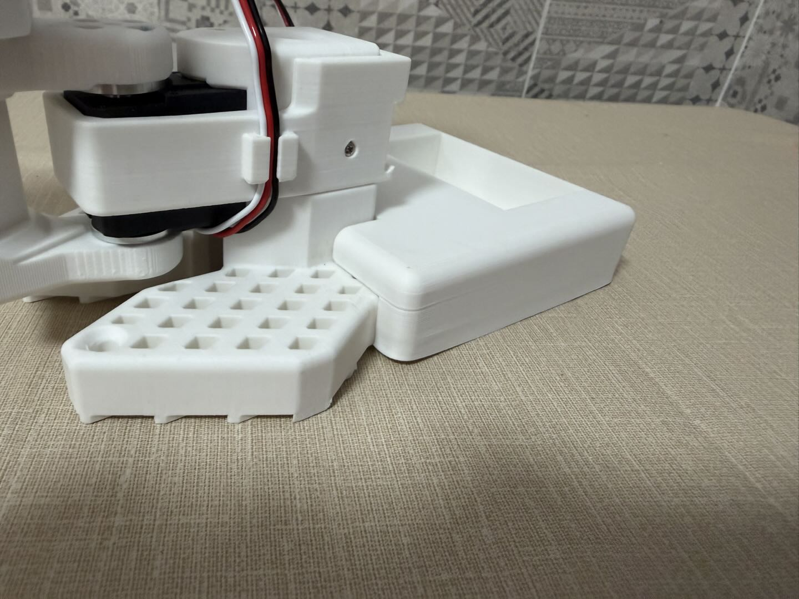
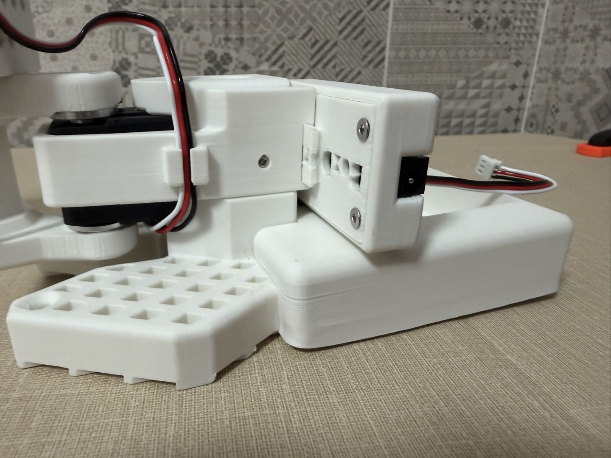
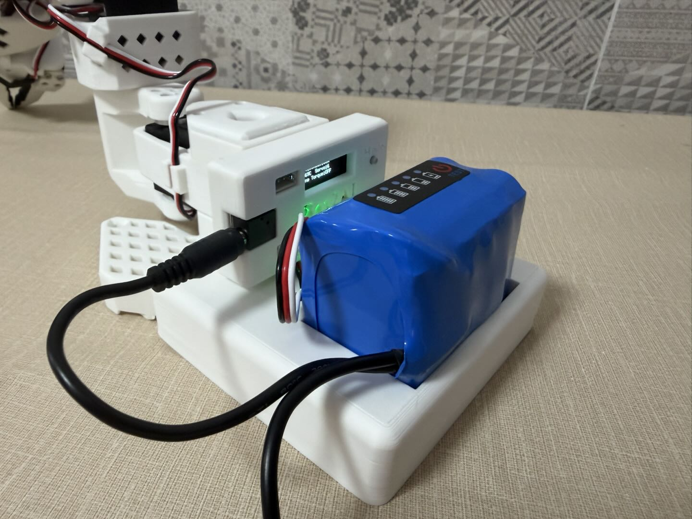
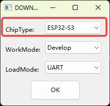
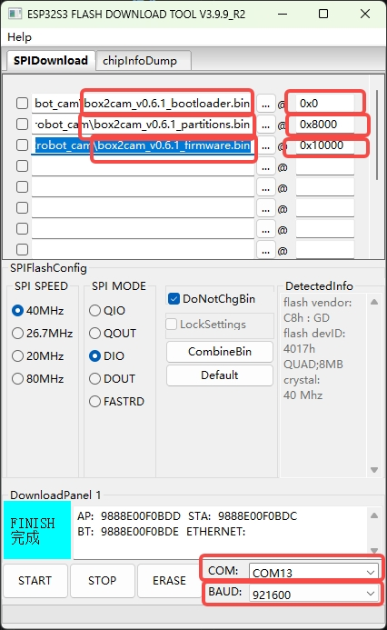

English | [中文](README.md)

# Box2Robot — Embodied AI Cloud Platform

**Plug-and-play robot arm with cloud training, shared skills, and AI agent control.**

<div align="center">
  
</div>

Box2Robot is an open-source embodied AI platform. It connects ESP32-powered robot arms and vision modules to a cloud platform for data collection, model training, and skill sharing. No complex setup — just flash, connect WiFi, bind your device, and start.

> **Current Release: v0.6.5** (Arm firmware v0.6.5 / Camera firmware v0.6.3)

## Getting Started

### 1. Get the Hardware

<div align="center">
  <a href="https://item.taobao.com/item.htm?abbucket=5&id=1030962099420">
    
  </a>
  <br>
  <a href="https://item.taobao.com/item.htm?abbucket=5&id=1030962099420">Purchase the Box2AI Robot Arm Kit (Taobao)</a>
</div>

Assemble the robot arm and connect servos to the driver board. The firmware comes pre-flashed. If you need to flash manually, see [Flash Firmware](#flash-firmware) below.

### Camera Module Installation

<div align="center">
  
  
  
</div>

<div align="center">
  
  
</div>

### Battery Tray & Driver Board Installation

<div align="center">
  
  
</div>

<div align="center">
  
  
</div>

### 2. Connect to Device Hotspot

Power on the device. It creates a WiFi hotspot:
- **Arm Driver Board:** `Box2Robot_XXXX` (XXXX = last 4 of MAC)
- **Vision-Audio Module:** `Box2Cam_XXXX`

Connect your phone/PC to this hotspot. A captive portal opens automatically (or go to `192.168.4.1`).

### 3. Configure WiFi

Enter your WiFi name and password in the portal. The device saves credentials, reboots, and connects to your network.

### 4. Bind on Platform

Once online, the device gets a **6-digit binding code**:
- **Arm:** Shown on the OLED screen
- **Camera:** Announced via TTS voice

Then:
1. Open [**https://robot.box2ai.com**](https://robot.box2ai.com/#/)
2. Register an account
3. Go to **Device Management → Bind Device**
4. Enter the 6-digit code
5. Done!

You now have full access: remote control, calibration, data collection, cloud training, skill store, and voice interaction.

### 5. Button Operations

The gray button on the wireless driver box supports the following:

| Action | Function |
|--------|----------|
| **Single Press** | Release Torque — unlocks all servos so you can freely move the arm by hand |
| **Long Press (3+ seconds)** | Factory Reset — clears saved WiFi credentials; the device reboots into hotspot mode for re-provisioning |

---

## AI Agent Control (Skills CLI)

Control your robot arm from **Claude Code**, **GPT**, or any AI agent using the `box2robot_skills/` CLI.

### Quick Start

```bash
cd box2robot_skills

# Login (token cached, no re-login needed)
python b2r.py login <username> <password>

# Control
python b2r.py devices                # List devices
python b2r.py home                   # Go to home position
python b2r.py move 1 2048 500        # Move servo #1 to position 2048
python b2r.py torque off             # Release torque
python b2r.py record start           # Start recording
python b2r.py record stop            # Stop recording
python b2r.py play                   # List & play trajectories

# Skill Store (ACT Store — browse / buy / run skills shared by others)
python b2r.py store list             # Browse the store
python b2r.py store info <task>      # Skill details
python b2r.py store buy  <task>      # Purchase a paid skill
python b2r.py store run  <task>      # Execute a skill on your device
python b2r.py store mine             # My purchased skills

python b2r.py say "take a photo"     # Natural language command
python b2r.py shell                  # Interactive shell
```

### Use with Claude Code

```
"Read box2robot_skills/SKILLS.md, then move servo 1 to position 2048"
"Record a trajectory, then play it back"
"Check servo status and go home"
```

See `box2robot_skills/SKILLS.md` for the full AI agent reference (79 actions, preflight checks, workflow templates).

---

## GPU Training & Inference Node

`box2robot_gpu_worker/` is a GPU compute node that connects to the Box2Robot cloud server and automatically picks up training and inference jobs.

Just 3 steps: install → start → enter binding code in the APP. Once bound, the Worker automatically polls for tasks, downloads datasets, trains models, and reports progress — all operations are managed from the APP.

Supports ACT (Action Chunking Transformer), Diffusion Policy, MLP and more. Requires RTX 3060+ GPU.

See [box2robot_gpu_worker/README.md](box2robot_gpu_worker/README.md) for details.

---

## Flash Firmware

Pre-built binaries are in `bin/`. Two devices need separate flashing:

### USB Driver

If your PC doesn't recognize the USB port, install the CP210x driver from `bin/download_driver_CP210x_USB_TO_UART/`.

### Method 1: esptool (Cross-Platform)

```bash
pip install esptool
```

**Arm Driver Board (ESP32):**

```bash
python -m esptool --chip esp32 erase_flash

python -m esptool --chip esp32 --baud 921600 write_flash 0x1000 bin/box2robot_arm/box2arm_v0.6.5_bootloader.bin 0x8000 bin/box2robot_arm/box2arm_v0.6.5_partitions.bin 0x10000 bin/box2robot_arm/box2arm_v0.6.5_firmware.bin
```

**Vision-Audio Module (ESP32-S3):**

```bash
python -m esptool --chip esp32s3 erase_flash

python -m esptool --chip esp32s3 --baud 921600 write_flash 0x0 bin/box2robot_cam/box2cam_v0.6.3_bootloader.bin 0x8000 bin/box2robot_cam/box2cam_v0.6.3_partitions.bin 0x10000 bin/box2robot_cam/box2cam_v0.6.3_firmware.bin
```

> esptool auto-detects the serial port. Use `--port COM5` to specify manually if multiple devices are connected.

### Method 2: Flash Download Tool (Windows GUI)

Use `bin/flash_download_tool_windows/flash_download_tool_3.9.9_R2.exe`.

1. Select chip type: **ESP32** for Arm, **ESP32-S3** for Camera. WorkMode: Develop, LoadMode: UART

<div align="center">
  
  
</div>

2. Add the 3 bin files with their addresses. Note the difference — Arm bootloader starts at **0x1000**, Camera at **0x0**; partition and firmware addresses are the same (0x8000 / 0x10000). Select COM port, baud 921600, click **START**

<div align="center">
  
  
</div>

3. Wait for **FINISH**:

   

---

## Changelog

| Version | Date | Notes |
|---------|------|-------|
| v0.6.5 (arm) | 2026-05-02 | CLI adds ACT Skill Store commands (`store list/info/buy/run/mine`); device/trajectory/job listings now show short codes; GPU Worker training/inference flow polished |
| v0.6.3 | 2026-04-26 | Flash docs revamped (esptool + Flash Download Tool); legacy bin files archived under `History/` |
| v0.6.1 | 2026-04-19 | GPU Worker open-sourced, fix Hiwonder servo calibration offset write, add servo voltage range selection (5V/7.4V/12V), WiFi Leader-Follower teleoperation smoothness optimization |
| v0.5.1 | 2026-04-14 | Cloud platform integration, WebSocket relay, OTA, ESP-NOW 50Hz, camera MJPEG+ADPCM audio, voice AI, auto-calibration |
| v0.4.5 | 2026-03-23 | (LeRobot-ESP32) Hiwonder LX servo support, auto-detect servo type |

## Links

- **Cloud Platform:** [https://robot.box2ai.com](https://robot.box2ai.com/#/)
- **Hardware Purchase:** [Taobao Store](https://item.taobao.com/item.htm?abbucket=5&id=1030962099420)
- **Previous Project (ESP-NOW only):** [LeRobot-ESP32](https://github.com/box2ai-robotics/lerobot-esp32)
- **LeRobot Framework:** [Hugging Face LeRobot](https://github.com/huggingface/lerobot)

## License

Apache 2.0 License

---

If this project helps you, please give it a star!
