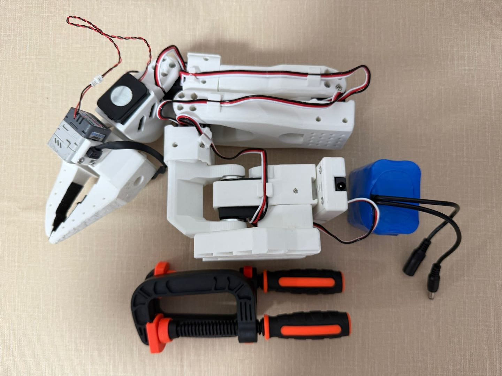
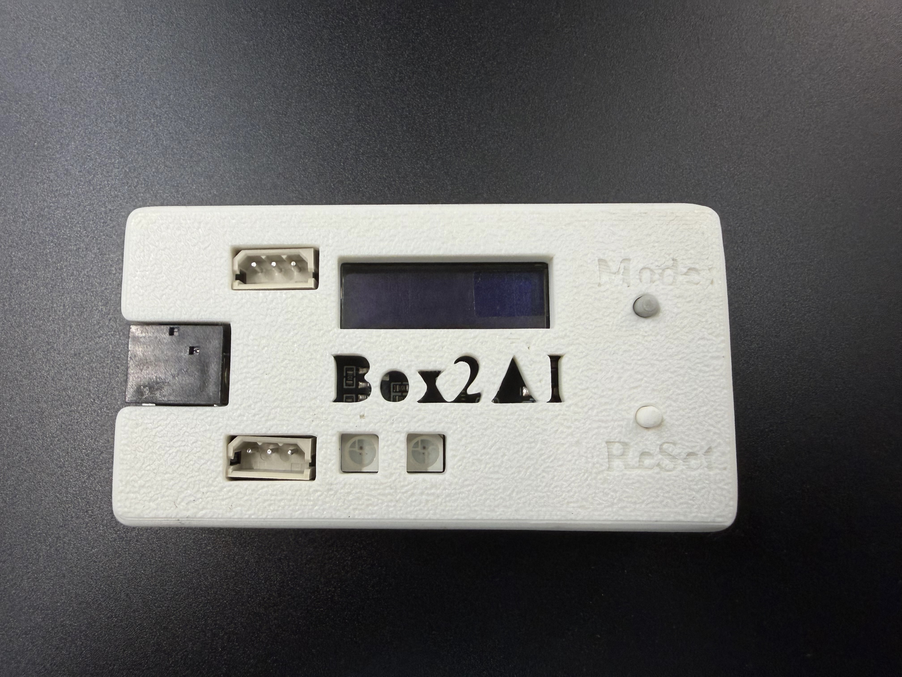
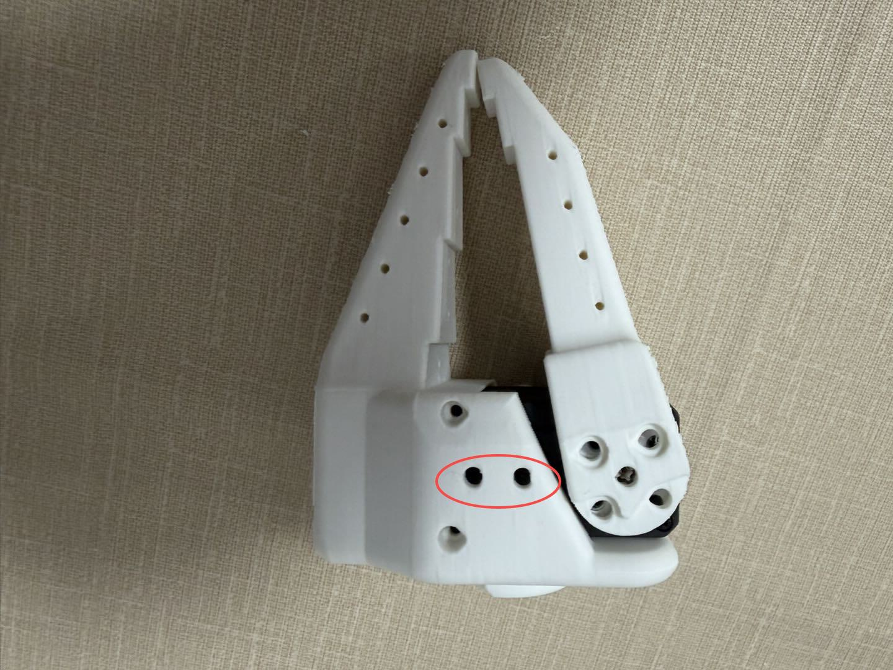
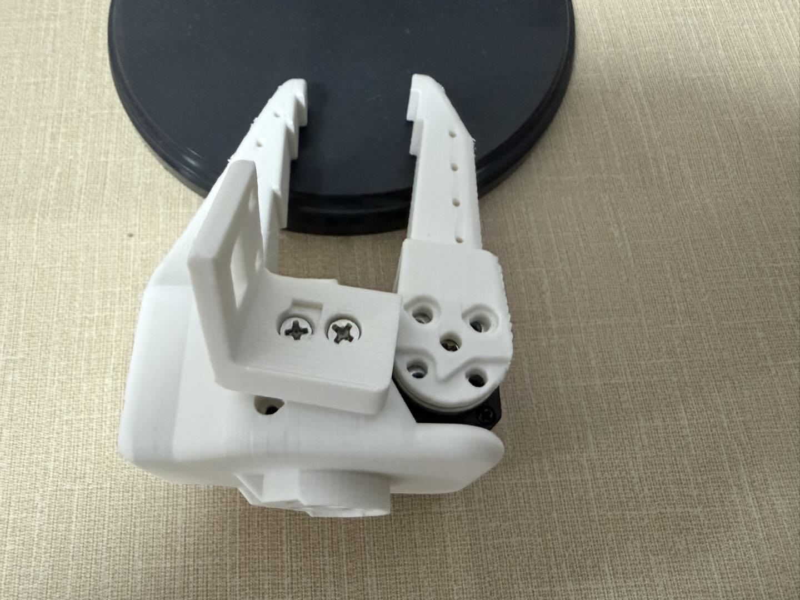
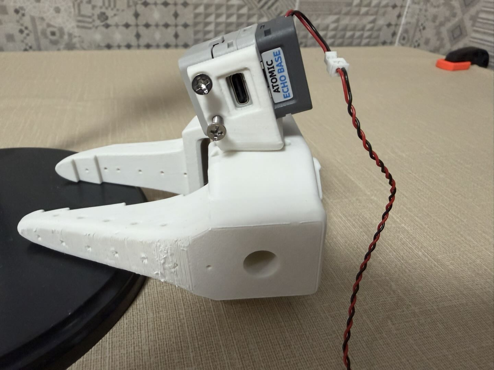
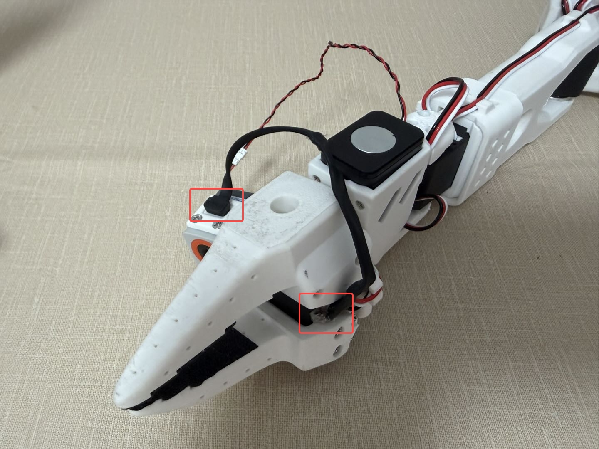
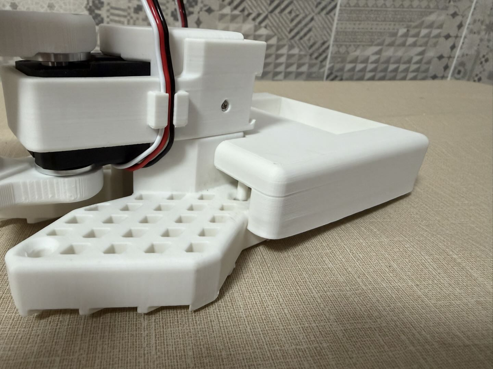
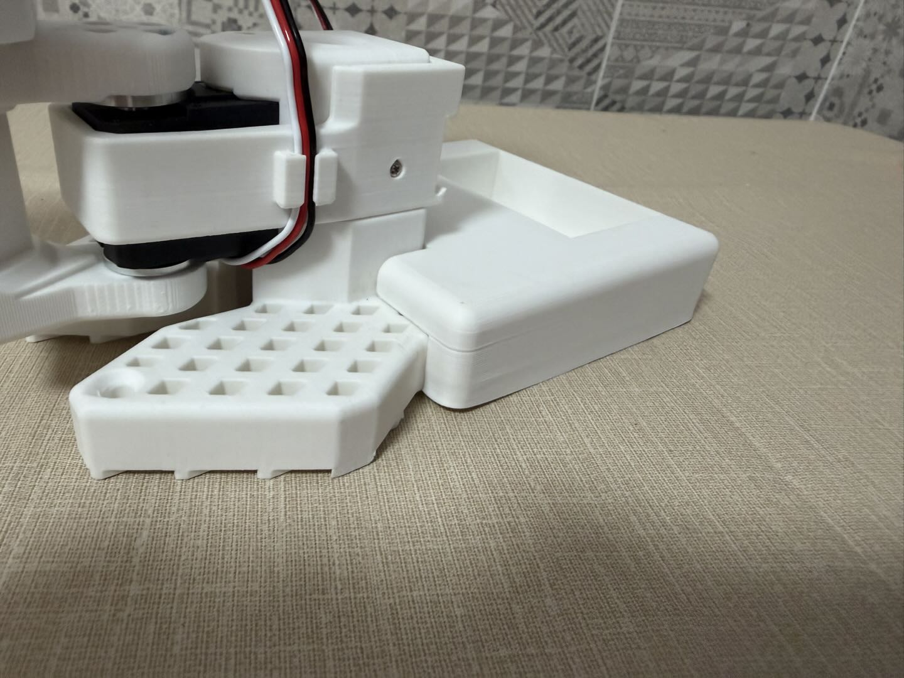
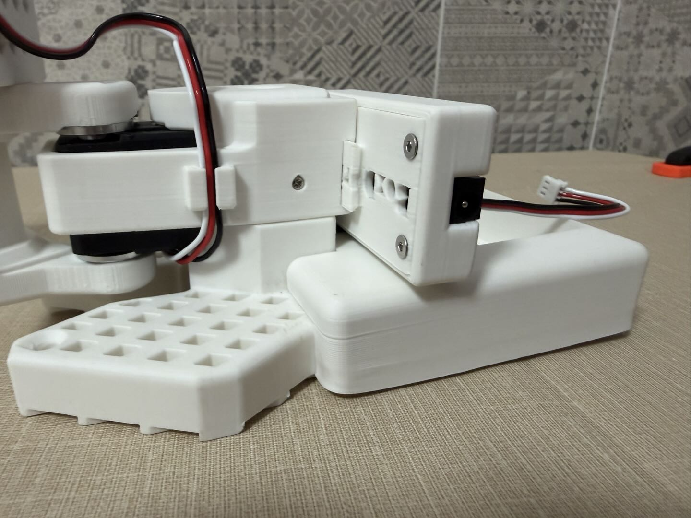
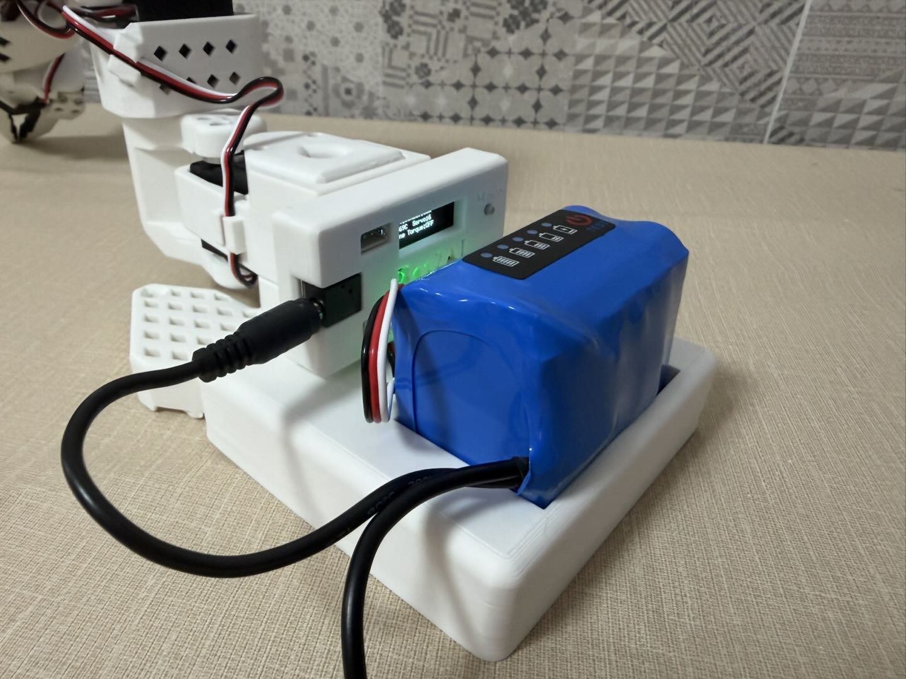

English | [中文](README.md)

# Box2Robot — Embodied AI Cloud Platform

**Plug-and-play robot arm with cloud training, shared skills, and AI agent control.**

<div align="center">
  
</div>

Box2Robot is an open-source embodied AI platform. It connects ESP32-powered robot arms and vision modules to a cloud platform for data collection, model training, and skill sharing. No complex setup — just flash, connect WiFi, bind your device, and start.

> **Current Release: v0.6.6** (Arm firmware v0.6.6 / Camera firmware v0.6.3)

## Getting Started

### 1. Get the Hardware

<div align="center">
  <a href="https://item.taobao.com/item.htm?abbucket=5&id=1030962099420">
    
  </a>
  <br>
  <a href="https://item.taobao.com/item.htm?abbucket=5&id=1030962099420">Purchase the Box2AI Robot Arm Kit (Taobao)</a>
</div>

Assemble the robot arm and connect servos to the driver board. The firmware comes pre-flashed. If you need to flash manually, see [Firmware Update](#firmware-update) below.

### Camera Module Installation

<div align="center">
  
  
  
</div>

<div align="center">
  
  
</div>

### Battery Tray & Driver Board Installation

<div align="center">
  
  
</div>

<div align="center">
  
  
</div>

### 2. Connect to Device Hotspot

Power on the device. It creates a WiFi hotspot:
- **Arm Driver Board:** `Box2Robot_XXXX` (XXXX = last 4 of MAC)
- **Vision-Audio Module:** `Box2Cam_XXXX`

Connect your phone/PC to this hotspot. A captive portal opens automatically (or go to `192.168.4.1`).

### 3. Configure WiFi

Enter your WiFi name and password in the portal. The device saves credentials, reboots, and connects to your network.

### 4. Bind on Platform

Once online, the device gets a **6-digit binding code**:
- **Arm:** Shown on the OLED screen
- **Camera:** Announced via TTS voice

Then:
1. Open [**https://robot.box2ai.com**](https://robot.box2ai.com/#/)
2. Register an account
3. Go to **Device Management → Bind Device**
4. Enter the 6-digit code
5. Done!

You now have full access: remote control, calibration, data collection, cloud training, skill store, and voice interaction.

### 5. Button Operations

The gray button on the wireless driver box supports the following:

| Action | Function |
|--------|----------|
| **Single Press** | Release Torque — unlocks all servos so you can freely move the arm by hand |
| **Long Press (3+ seconds)** | Factory Reset — clears saved WiFi credentials; the device reboots into hotspot mode for re-provisioning |

---

## AI Agent Control (Skills CLI)

Let **Claude Code**, **GPT**, or any AI agent control your robot arm directly. Box2Robot offers two ways to plug in:

### Option 1: One-Click Install from ClawHub (Recommended)

[**ClawHub · box2robot-skills →**](https://clawhub.ai/boxjod/box2robot-skills)

No need to clone the repo — install the `box2robot-skills` package from ClawHub and your AI Agent can control the arm through the cloud out of the box. Recommended for most users.

### Option 2: Clone the Repository (Developers)

If you want to customize Actions, modify the source, or run the CLI offline, clone the repo:

```bash
git clone https://github.com/box2ai-robotics/box2robot.git
cd box2robot/box2robot_skills

# Login (token cached, no re-login needed)
python b2r.py login <username> <password>

# Control
python b2r.py devices                # List devices
python b2r.py home                   # Go to home position
python b2r.py move 1 2048 500        # Move servo #1 to position 2048
python b2r.py torque off             # Release torque
python b2r.py record start           # Start recording
python b2r.py record stop            # Stop recording
python b2r.py play                   # List & play trajectories

# Skill Store (ACT Store — browse / buy / run skills shared by others)
python b2r.py store list             # Browse the store
python b2r.py store info <task>      # Skill details
python b2r.py store buy  <task>      # Purchase a paid skill
python b2r.py store run  <task>      # Execute a skill on your device
python b2r.py store mine             # My purchased skills

python b2r.py say "take a photo"     # Natural language command
python b2r.py shell                  # Interactive shell
```

### Use with Claude Code

```
"Read box2robot_skills/SKILLS.md, then move servo 1 to position 2048"
"Record a trajectory, then play it back"
"Check servo status and go home"
```

See `box2robot_skills/SKILLS.md` for the full AI agent reference (79 actions, preflight checks, workflow templates).

---

## GPU Training & Inference Node (Advanced)

`box2robot_gpu_worker/` is a GPU compute node that connects to the Box2Robot cloud server and automatically picks up training and inference jobs. Requires an **RTX 3060+ GPU**, supports ACT (Action Chunking Transformer), Diffusion Policy, MLP and more.

Just 3 steps: install → start → enter binding code in the APP. Once bound, the Worker automatically polls for tasks, downloads datasets, trains models, and reports progress — all operations are managed from the APP.

When cloning, **you must include `--recurse-submodules`** to pull the LeRobot submodule:

```bash
git clone --recurse-submodules https://github.com/box2ai-robotics/box2robot.git
```

> Already cloned without submodules? Run `git submodule update --init --recursive` in the repo root to fetch LeRobot.

See [box2robot_gpu_worker/README.md](box2robot_gpu_worker/README.md) for details.

---

## Firmware Update

The device ships with the latest firmware pre-flashed. **Online OTA update is recommended**:

1. After binding, open [https://robot.box2ai.com](https://robot.box2ai.com/#/) → **Device Management**
2. In device details, click **Firmware Update**. The cloud will push the latest firmware automatically.

**Manual flashing** (for first-time flashing of blank boards, devices that won't boot, or custom-built firmware): see [`bin/README_en.md`](bin/README_en.md).

---

## Changelog

| Version | Date | Notes |
|---------|------|-------|
| v0.6.6 (arm) | 2026-05-04 | Fix WS disconnect during recording (transport_poll_write): RAM recording buffer 1200→300 frames frees ~80KB BSS, heap recovers from 30KB to ~110KB; long recordings fall back to SPIFFS |
| v0.6.5 (arm) | 2026-05-02 | CLI adds ACT Skill Store commands (`store list/info/buy/run/mine`); device/trajectory/job listings now show short codes; GPU Worker training/inference flow polished |
| v0.6.3 | 2026-04-26 | Flash docs revamped (esptool + Flash Download Tool); legacy bin files archived under `History/` |
| v0.6.1 | 2026-04-19 | GPU Worker open-sourced, fix Hiwonder servo calibration offset write, add servo voltage range selection (5V/7.4V/12V), WiFi Leader-Follower teleoperation smoothness optimization |
| v0.5.1 | 2026-04-14 | Cloud platform integration, WebSocket relay, OTA, ESP-NOW 50Hz, camera MJPEG+ADPCM audio, voice AI, auto-calibration |
| v0.4.5 | 2026-03-23 | (LeRobot-ESP32) Hiwonder LX servo support, auto-detect servo type |

## Links

- **Cloud Platform:** [https://robot.box2ai.com](https://robot.box2ai.com/#/)
- **Hardware Purchase:** [Taobao Store](https://item.taobao.com/item.htm?abbucket=5&id=1030962099420)
- **Previous Project (ESP-NOW only):** [LeRobot-ESP32](https://github.com/box2ai-robotics/lerobot-esp32)
- **LeRobot Framework:** [Hugging Face LeRobot](https://github.com/huggingface/lerobot)

## License

Apache 2.0 License

---

If this project helps you, please give it a star!
