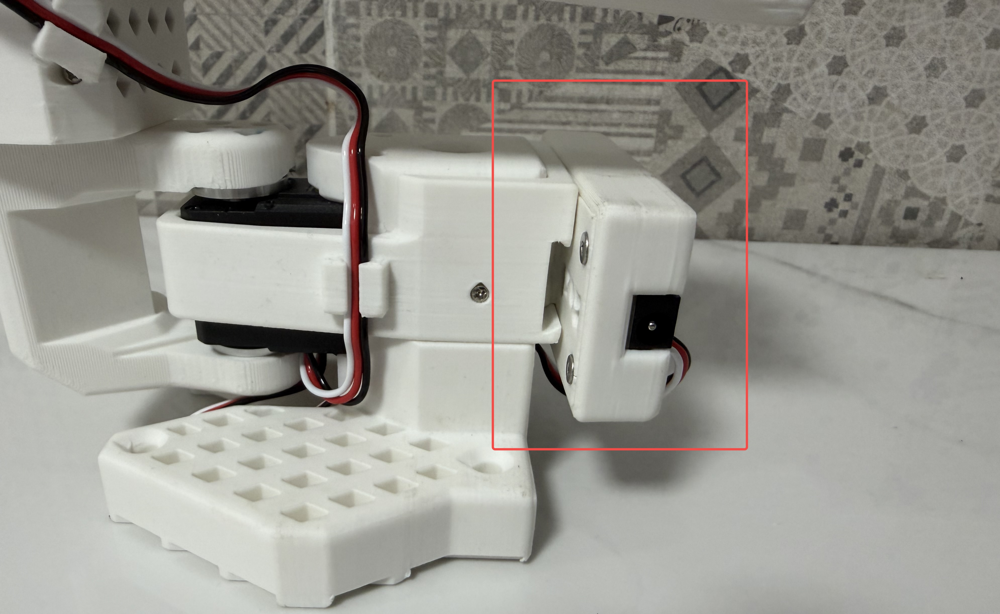
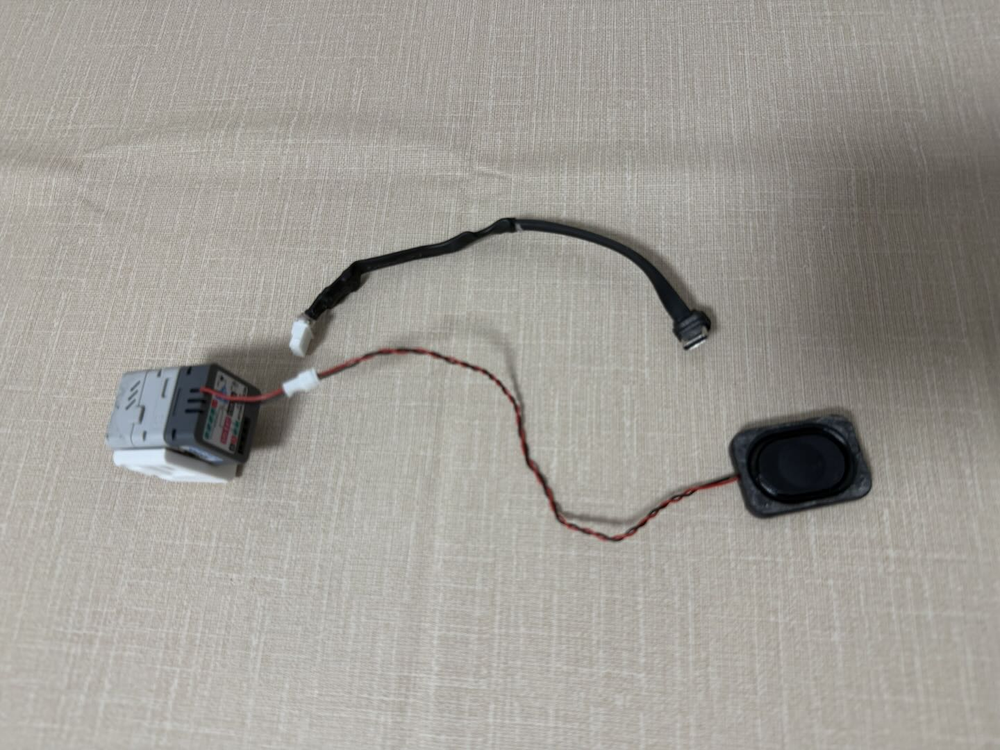

[English](README.md) | 中文

# Box2Robot：首个具身智能云平台

**云端数据采集、训练与推理 —— 海量共享资源与技能库。**

Box2Robot 是一个基于 ESP32 机械臂和视觉模块的开源具身智能平台。提供从硬件到云端的完整流水线：插上设备、连接平台，即可开始采集数据、训练模型或部署共享技能 —— 一切操作通过手机 APP 或网页完成。

> **当前版本 (v0.5.1)：** 机械臂驱动板固件 + 视觉语音模块固件已开源。云端平台、GPU Worker、Audio Node 将逐步开放。

## 快速开始

**从开箱到全功能控制，只需 5 步：**

### 第一步：获取硬件

<div align="center">
  <a href="https://item.taobao.com/item.htm?abbucket=5&id=1030962099420">
    
  </a>
  <br>
  <a href="https://item.taobao.com/item.htm?abbucket=5&id=1030962099420">购买 Box2AI 机械臂套件 (淘宝)</a>
</div>

组装机械臂并将舵机连接到驱动板。如果固件未预装，请参阅下方 [烧录固件](#烧录固件) 章节。

### 第二步：连接设备热点

给设备上电，设备会创建 WiFi 热点：
- **机械臂驱动板：** `Box2Robot_XXXX` (XXXX 为 MAC 地址后 4 位)
- **视觉语音模块：** `Box2Cam_XXXX`

用手机或电脑连接该热点。会自动弹出配网页面（如未弹出，手动访问 `192.168.4.1`）。

### 第三步：配置室内 WiFi

在配网页面输入你家里/办公室的 WiFi 名称和密码。设备会保存凭据、重启并连接到你的 WiFi 网络。

### 第四步：注册账号并绑定设备

设备连上 WiFi 后，会自动向云端平台注册并获取 **6 位绑定码**：
- **机械臂驱动板：** 绑定码显示在 OLED 屏幕上
- **视觉语音模块：** 通过 TTS 语音播报绑定码

打开平台完成绑定：

1. 用手机或电脑访问 [**https://robot.box2ai.com**](https://robot.box2ai.com/#/)
2. 注册账号（短信验证码）
3. 进入 **设备管理 → 绑定设备**
4. 输入 OLED 屏幕上显示 / 语音播报的 6 位绑定码
5. 完成！设备已绑定到你的账号

### 第五步：畅享全部功能

绑定完成后，即可使用平台全部功能：
- **远程遥控** — APP 摇杆控制机械臂
- **AI 智能体控制** — 通过 Claude Code、GPT 等 AI 智能体远程控制机械臂（见下方 [AI 智能体控制](#ai-智能体控制)）
- **校准** — 自动校准舵机行程 / 手动中心偏移校准
- **数据采集** — Leader-Follower ESP-NOW 双臂录制 + 摄像头同步
- **云端训练** — 提交训练任务、监控进度、部署模型
- **技能商店** — 浏览和执行社区共享的 ACT 技能
- **语音交互** — 通过视觉语音模块与机械臂对话

## 当前开源内容

| 模块 | 状态 | 说明 |
|------|------|------|
| **机械臂驱动板固件** | 已开源 | ESP32 舵机驱动、ESP-NOW 同步、WiFi+WS、校准、OTA |
| **视觉语音模块固件** | 已开源 | ESP32-S3 摄像头 (OV3660) + 音频 (ES8311)、MJPEG 推流、ADPCM 语音 |
| **Skills CLI (AI 智能体控制)** | 已开源 | 一行命令 CLI + SKILLS.md 供 Claude Code / GPT 等 AI 智能体调度 |
| **烧录工具 & 驱动** | 已开源 | esptool、Flash Download Tool (Windows)、CP210x USB 驱动 |
| 云端平台 (后端 + 前端) | 即将开放 | aiohttp 后端 + Vue3 UniApp 前端 |
| GPU Worker (训练 & 推理) | 即将开放 | LeRobot ACT 框架、云端训练流水线 |
| Audio Node (语音 AI) | 即将开放 | FunASR + LLM + TTS、语音控制机械臂 |

## 系统架构

```
┌─────────────────────────────────────────────────────────────┐
│  云端平台: robot.box2ai.com                                  │
│  ├── 用户 APP (H5/手机)                                      │
│  ├── AI 智能体 CLI (Claude Code / GPT → b2r.py → HTTP API)  │
│  ├── ACT 技能商店 (共享技能与模型)                              │
│  ├── 云端训练 (提交任务 → GPU 训练 → 部署)                     │
│  └── WebSocket 中继 (实时设备控制)                             │
├─────────────────────────────────────────────────────────────┤
│  GPU 节点 (可扩展，即插即用)                                   │
│  ├── 训练 Worker (LeRobot ACT, 数据 → 模型)                   │
│  └── 推理服务 (模型 → 20Hz 实时控制)                           │
├─────────────────────────────────────────────────────────────┤
│  Audio 节点 (可扩展，即插即用)                                  │
│  ├── ASR 引擎 (FunASR SenseVoice, 语音 → 文字)                │
│  ├── LLM 对话 (GLM-4 + 机械臂工具调用)                        │
│  └── TTS 引擎 (edge-tts, 文字 → 语音)                         │
├─────────────────────────────────────────────────────────────┤
│  设备 (标准化硬件)                                             │
│  ├── 机械臂驱动板 (ESP32, 6-DOF 舵机控制)                      │
│  │   └── ESP-NOW: 主从臂 50Hz 直连 (<3ms 延迟)                │
│  └── 视觉语音模块 (ESP32-S3, 摄像头 + 麦克风 + 扬声器)          │
│      └── MJPEG 图像流 + ADPCM 音频流 (WebSocket)              │
└─────────────────────────────────────────────────────────────┘
```

### 设计理念

- **GPU 节点化：** 任何有 GPU 的机器都可以注册为训练/推理节点 —— 平台自动调度任务。
- **Audio 节点化：** 任何有 GPU 的机器都可以注册为语音处理节点 —— ASR、LLM 推理、TTS 独立于设备运行。
- **设备标准化：** 驱动板和视觉模块使用统一协议。插电、连 WiFi、平台绑定，即可使用。

## 硬件详情

### 机械臂驱动板 (ESP32)

**原理图：**


- **主控：** ESP32-WROOM-32 (4MB Flash，关闭蓝牙以节省内存用于 WiFi+ESP-NOW)
- **舵机总线：** UART 1Mbps，支持飞特 SC/ST 系列 + 幻尔 LX 系列
- **通信：** WiFi (WebSocket 连接云端) + ESP-NOW (主从臂 50Hz 直连同步)
- **显示：** SSD1306 OLED (128x64，显示绑定码)
- **指示灯：** WS2812 RGB x2 (模式 + 状态指示)
- **功能：** 自动校准、OTA 升级、轨迹录制/回放、回零位

### 驱动盒安装

驱动板装在 3D 打印的驱动盒中，固定在机械臂腕部关节处。如图所示（红框标注），用螺丝将驱动盒固定到臂体结构上：

<div align="center">
  
</div>

### 视觉语音模块 (ESP32-S3)

<div align="center">
  
  <br>
  Box2AI 视觉语音模块 (购买链接即将上线)
</div>

**系统框图：**

```
┌───────────────────────────────────────┐
│       AtomS3R-M12 主控                │
│  ┌─────────┐ ┌──────┐ ┌──────────┐  │
│  │ OV3660  │ │BMI270│ │ 0.85"IPS │  │
│  │ 300万   │ │六轴  │ │ 显示屏   │  │
│  │ 摄像头  │ │ IMU  │ │          │  │
│  └─────────┘ └──────┘ └──────────┘  │
│       ESP32-S3-PICO (8MB+8MB)        │
│          WiFi + BLE 5.0              │
└──────────────┬───────────────────────┘
               │ 堆叠连接器
┌──────────────┴───────────────────────┐
│       Atomic Echo 音频底座            │
│  ┌─────────┐  ┌──────────────────┐  │
│  │ ES8311  │  │ NS4150B D类功放  │  │
│  │ 24位    │  │ 1W 放大器        │  │
│  │ 编解码  │  │    ↓             │  │
│  └────┬────┘  │ 1W 8Ω 扬声器    │  │
│  ┌────┴────┐  └──────────────────┘  │
│  │MEMS 麦克│                         │
│  │风       │                         │
│  └─────────┘                         │
└───────────────────────────────────────┘
```

- **主控：** ESP32-S3-PICO-1-N8R8 (8MB Flash + 8MB PSRAM，双核 LX7 @ 240MHz)
- **摄像头：** OV3660 300万像素，M12 120° 广角镜头，默认 VGA JPEG (5档分辨率：QQVGA/QVGA/VGA/SVGA/XGA)
- **音频编解码：** ES8311 24位 (I2C 0x18)，MEMS 麦克风 + NS4150B D类 1W 功放 + 扬声器
- **通信：** WiFi (WebSocket 双通道：JPEG 图像流 + ADPCM 音频流)
- **尺寸：** 24 x 24 x ~32 mm (主控 + 音频底座堆叠)
- **功能：** MJPEG 推流、语音采集与播放、TTS 语音引导、ESP-NOW WiFi 分享、OTA 升级

### 摄像头模块安装

视觉语音模块安装在机械臂末端夹爪上，按以下 4 步操作：

**第 1 & 2 步：确认内嵌螺母和安装孔位**

夹爪内部**预埋了六角螺母**（左图红圈标注）。对应的**安装孔位在夹爪外侧**（右图红圈标注）。

| 内嵌螺母（夹爪内部） | 安装孔位（夹爪外侧） |
|:---:|:---:|
|  |  |

**第 3 & 4 步：固定摄像头底座，安装摄像头**

将摄像头底座支架对准安装孔，用**两颗螺丝**拧紧固定（左图）。然后将 AtomS3R 摄像头模块（含 Atomic Echo Base 音频底座）放置到支架上，用螺丝固定（右图）。线缆沿机械臂走线。

| 螺丝固定摄像头底座 | 安装摄像头模块 |
|:---:|:---:|
|  |  |

## AI 智能体控制

除了网页端控制，你还可以通过 **Claude Code**、**GPT** 等 AI 智能体，使用 `box2robot_skills/` CLI 直接远程控制机械臂。无需打开浏览器，在终端即可完成自动化控制和 AI 驱动的任务编排。

### 快速开始

```bash
cd box2robot_skills

# 1. 登录 (token 缓存到 ~/.b2r_token，后续免登录)
python b2r.py login <username> <password>

# 2. 查看设备
python b2r.py devices

# 3. 操控
python b2r.py home                    # 回零位
python b2r.py move 1 2048 500         # 1号舵机转到2048
python b2r.py torque off              # 释放力矩 (可手动拖拽)
python b2r.py record start            # 开始录制轨迹
python b2r.py record stop             # 停止录制
python b2r.py play                    # 列出并播放轨迹
python b2r.py say "拍个照"             # 自然语言指令
python b2r.py shell                   # 交互式 Shell
```

### 配合 Claude Code 使用

让 Claude Code 读取 `SKILLS.md` 即可获得完整的机械臂控制能力：

```
# 在 Claude Code 中直接说：
"读一下 box2robot_skills/SKILLS.md，然后把1号舵机转到2048"
"录一段我拖动机械臂的轨迹，录完后播放一遍"
"查看舵机状态，然后回零位"
```

Claude Code 会通过 `b2r.py` CLI 命令远程控制机械臂 —— 无需打开网页。`SKILLS.md` 包含完整的 AI 智能体调度参考（79 个 Action、预检规则、工作流模板）。

### 全部命令

| 命令 | 说明 | 示例 |
|------|------|------|
| `login [user] [pass]` | 登录并缓存 token | `b2r.py login user pass` |
| `devices` | 列出所有设备 | `b2r.py devices` |
| `status` | 舵机位置和力矩状态 | `b2r.py status` |
| `move <id> <pos> [speed]` | 移动单个舵机 | `b2r.py move 1 2048 500` |
| `home` | 回零位 | `b2r.py home` |
| `torque on/off` | 力矩锁定/释放 | `b2r.py torque off` |
| `record start/stop` | 录制轨迹 | `b2r.py record start` |
| `play [traj_id]` | 播放轨迹 | `b2r.py play` |
| `say "文本"` | 自然语言指令 | `b2r.py say "拍个照"` |
| `exec <action>` | 直接调用 Action | `b2r.py exec camera.snapshot` |
| `shell` | 交互式 Shell | `b2r.py shell` |

> 详见 `box2robot_skills/SKILLS.md`（AI 智能体调度手册）和 `box2robot_skills/README.md`。

## 烧录固件

预编译固件在 `bin/` 目录下。两个设备需要分别烧录：

| 设备 | 芯片 | 固件目录 |
|------|------|---------|
| 机械臂驱动板 | ESP32 | `bin/box2robot_arm/` |
| 视觉语音模块 | ESP32-S3 | `bin/box2robot_cam/` |

### USB 驱动

如果电脑无法识别 ESP32 的 USB 端口，请安装 `bin/download_driver_CP210x_USB_TO_UART/` 中的 CP210x 驱动：

| Windows 版本 | 驱动文件夹 |
|-------------|-----------|
| Windows 10/11 | `CP210x_WIN10/` |
| Windows 7/8 (64位) | `CP210x_WIN7_WIN8 64/` |
| Windows XP / Win7 (32位) | `CP210x_XP_WIN7_32/` |

运行安装程序，重新插入 ESP32，设备管理器中应出现 COM 端口。

### 查找串口号

将 ESP32 通过 USB 连接到电脑，查找分配的串口号：

| 平台 | 命令 | 示例输出 |
|------|------|---------|
| **Windows** (PowerShell) | `Get-CimInstance Win32_SerialPort \| Select Name, DeviceID` | `COM5` |
| **Windows** (CMD) | `mode` | `COM5` |
| **macOS** | `ls /dev/cu.usb*` | `/dev/cu.usbserial-0001` |
| **Linux** | `ls /dev/ttyUSB* /dev/ttyACM*` | `/dev/ttyUSB0` |

> **提示：** Windows 下打开 **设备管理器 → 端口 (COM 和 LPT)** 查看端口名称。

### 方法一：Python esptool (跨平台)

```bash
pip install esptool
```

#### 烧录机械臂驱动板 (ESP32)

需要烧录 3 个文件 (引导程序 + 分区表 + 应用固件)：

| 文件 | 烧录地址 | 说明 |
|------|---------|------|
| `box2arm_v0.5.1_bootloader.bin` | `0x1000` | 引导程序 |
| `box2arm_v0.5.1_partitions.bin` | `0x8000` | 分区表 |
| `box2arm_v0.5.1_firmware.bin` | `0x10000` | 应用固件 |

```bash
# 擦除 Flash (清除 WiFi 和绑定数据 - 首次烧录必须执行)
python -m esptool --chip esp32 --port COM5 erase_flash

# 烧录全部 3 个文件
python -m esptool --chip esp32 --port COM5 --baud 921600 write_flash \
  0x1000  bin/box2robot_arm/box2arm_v0.5.1_bootloader.bin \
  0x8000  bin/box2robot_arm/box2arm_v0.5.1_partitions.bin \
  0x10000 bin/box2robot_arm/box2arm_v0.5.1_firmware.bin
```

#### 烧录视觉语音模块 (ESP32-S3)

> **注意：** ESP32-S3 的引导程序地址是 `0x0`，与 ESP32 的 `0x1000` 不同。

| 文件 | 烧录地址 | 说明 |
|------|---------|------|
| `box2cam_v0.5.1_bootloader.bin` | `0x0` | 引导程序 |
| `box2cam_v0.5.1_partitions.bin` | `0x8000` | 分区表 |
| `box2cam_v0.5.1_firmware.bin` | `0x10000` | 应用固件 |

```bash
# 擦除 Flash
python -m esptool --chip esp32s3 --port COM6 erase_flash

# 烧录全部 3 个文件
python -m esptool --chip esp32s3 --port COM6 --baud 921600 write_flash \
  0x0     bin/box2robot_cam/box2cam_v0.5.1_bootloader.bin \
  0x8000  bin/box2robot_cam/box2cam_v0.5.1_partitions.bin \
  0x10000 bin/box2robot_cam/box2cam_v0.5.1_firmware.bin
```

> 请将 `COM5` / `COM6` 替换为你的实际端口。macOS/Linux 下使用 `/dev/ttyUSB0` 或 `/dev/cu.usbserial-0001`。

### 方法二：Flash Download Tool (Windows 图形工具)

使用 `bin/flash_download_tool_windows/flash_download_tool_3.9.9_R2.exe`。

1. 打开工具。**机械臂驱动板**选择 **ChipType: ESP32**；**视觉语音模块**选择 **ChipType: ESP32-S3**。设置 **WorkMode: Develop**，**LoadMode: UART**，点击 OK：

   

2. 添加 3 个 bin 文件及对应地址（参考上方地址表），选择 COM 端口和波特率 `921600`，点击 **START**：

   

3. 等待状态显示 **FINISH**：

   

## 目录结构

```
box2robot/
├── assets/                                  # 图片和文档素材
│   ├── hardware.jpg                         # 驱动板实物照片
│   ├── hardware_SchDoc.png                  # 驱动板原理图
│   ├── hardware_cam.jpg                      # 视觉语音模块照片
│   ├── Drive_enclosure_mounting_method.jpg   # 驱动盒安装方式
│   ├── Hiwonder-feetech.png                # 舵机线序对比
│   ├── Camera_base mounting_nut.jpg         # 摄像头安装：内嵌螺母
│   ├── Camera_base_mounting_hole.jpg        # 摄像头安装：安装孔位
│   ├── Camera_base_screw_placement_fixation.jpg  # 摄像头安装：固定底座
│   ├── Camera_placement_and_screw_fixation.jpg   # 摄像头安装：安装模块
│   ├── flash_esp32.jpg                      # 烧录工具：芯片选择
│   ├── flash_select_bins.jpg                # 烧录工具：文件选择
│   └── flahs_succesful.jpg                  # 烧录工具：烧录成功
├── bin/
│   ├── box2robot_arm/                       # 机械臂驱动板固件 (v0.5.1)
│   │   ├── box2arm_v0.5.1_bootloader.bin    # 引导程序 (ESP32, 地址: 0x1000)
│   │   ├── box2arm_v0.5.1_partitions.bin    # 分区表 (地址: 0x8000)
│   │   └── box2arm_v0.5.1_firmware.bin      # 应用固件 (地址: 0x10000)
│   ├── box2robot_cam/                       # 视觉语音模块固件 (v0.5.1)
│   │   ├── box2cam_v0.5.1_bootloader.bin    # 引导程序 (ESP32-S3, 地址: 0x0)
│   │   ├── box2cam_v0.5.1_partitions.bin    # 分区表 (地址: 0x8000)
│   │   └── box2cam_v0.5.1_firmware.bin      # 应用固件 (地址: 0x10000)
│   ├── flash_download_tool_windows/         # Espressif Flash Download Tool (Windows)
│   └── download_driver_CP210x_USB_TO_UART/  # USB 转串口驱动 (Windows)
├── box2robot_skills/                        # AI 智能体 CLI (Claude Code / GPT 远程控制)
│   ├── b2r.py                               # 一行命令入口
│   ├── SKILLS.md                            # AI 智能体调度手册 (79 个 Action)
│   └── README.md                            # CLI 快速开始
├── box2robot_dashboard/                     # (即将开放) 局域网 Dashboard
├── box2robot_gpu_worker/                    # (即将开放) 训练与推理
├── box2roboy_audio/                         # (即将开放) 语音 AI 节点
└── README.md                                # 本文件
```

## 更新日志

| 版本 | 日期 | 说明 |
|------|------|------|
| v0.5.1 | 2026-04-14 | 云端平台集成、WebSocket 中继、OTA、ESP-NOW 50Hz 双通道、摄像头 MJPEG+ADPCM 音频、语音 AI 链路、自动校准、数据采集对齐 |
| v0.4.5 | 2026-03-23 | (LeRobot-ESP32) 幻尔 LX 舵机支持、自动检测舵机类型 |

## 相关链接

- **云端平台：** [https://robot.box2ai.com](https://robot.box2ai.com/#/)
- **硬件购买：** [淘宝店铺](https://item.taobao.com/item.htm?abbucket=5&id=1030962099420)
- **前代项目 (纯 ESP-NOW)：** [LeRobot-ESP32](https://github.com/box2ai-robotics/lerobot-esp32)
- **LeRobot 框架：** [Hugging Face LeRobot](https://github.com/huggingface/lerobot)

## 开源协议

Apache 2.0 License

---

如果这个项目对你有帮助，请给个 Star！
