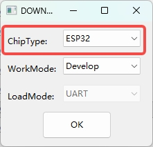
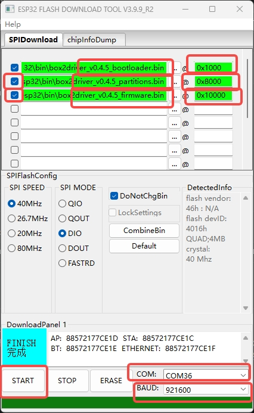
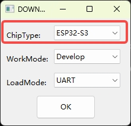
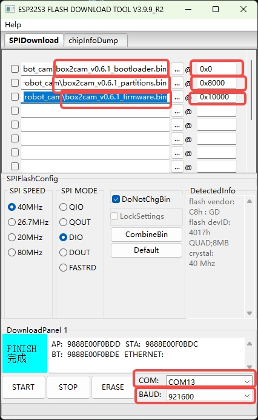
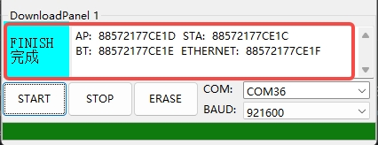

[English](README_en.md) | 中文

# Box2Robot 烧录教程

本目录提供 Box2Robot 机械臂驱动板与视觉语音模块的预编译固件，以及详细的离线烧录方法。

> **优先推荐：在线 OTA 升级**
> 如果设备已绑定云端平台并能正常联网，请直接通过 [https://robot.box2ai.com](https://robot.box2ai.com/#/) 进行 OTA 升级，无需手动烧录。
> 仅在以下情况下才需要参照本教程手动烧录：首次烧录空板、设备无法启动、OTA 失败需要恢复、需要刷写自编译固件。

---

## 目录结构

```
bin/
├── box2robot_arm/                       # 机械臂驱动板固件 (ESP32)
│   ├── box2arm_v0.6.6_bootloader.bin
│   ├── box2arm_v0.6.6_partitions.bin
│   ├── box2arm_v0.6.6_firmware.bin
│   └── History/                         # 历史版本
├── box2robot_cam/                       # 视觉语音模块固件 (ESP32-S3)
│   ├── box2cam_v0.6.3_bootloader.bin
│   ├── box2cam_v0.6.3_partitions.bin
│   ├── box2cam_v0.6.3_firmware.bin
│   └── history/                         # 历史版本
├── download_driver_CP210x_USB_TO_UART/  # CP210x USB 转串口驱动
└── flash_download_tool_windows/         # 乐鑫官方 Windows 烧录工具
    └── flash_download_tool_3.9.9_R2.exe
```

> 当前版本：机械臂固件 v0.6.6 / 摄像头固件 v0.6.3。两个设备需要分别烧录。

---

## 烧录前准备

### 1. 硬件连接

- 烧录程序时，**只需要连接 USB-C 数据线**。
- **不需要连接 DC 电源线**，避免双路供电导致芯片异常。
- 确认 USB-C 数据线为**数据线**而非纯充电线（部分廉价线只有电源没有数据触点）。

### 2. 安装 USB 驱动

如果电脑无法识别串口（设备管理器中无 `COMx` 端口），请安装 CP210x 驱动：

- Windows：进入 `bin/download_driver_CP210x_USB_TO_UART/`，运行其中的安装程序
- macOS：从 [Silicon Labs 官网](https://www.silabs.com/developers/usb-to-uart-bridge-vcp-drivers) 下载 macOS 驱动并安装
- Linux：内核已自带 `cp210x.ko`，通常无需安装

### 3. 确认串口号

- **Windows**：打开 *设备管理器* → *端口 (COM 和 LPT)*，找到 `Silicon Labs CP210x USB to UART Bridge (COMx)`
- **macOS**：终端执行 `ls /dev/cu.SLAB_USBtoUART*` 或 `ls /dev/tty.usbserial*`
- **Linux**：终端执行 `ls /dev/ttyUSB*`，通常为 `/dev/ttyUSB0`

---

## 方法一：esptool 命令行（跨平台推荐）

esptool 是乐鑫官方的命令行烧录工具，兼容 Windows / macOS / Linux。

### 1. 安装 esptool

```bash
pip install -U esptool
```

### 2. 烧录机械臂驱动板（ESP32）

清空 Flash：

```bash
python -m esptool --chip esp32 erase_flash
```

写入固件（注意 bootloader 起始地址为 **0x1000**）：

```bash
python -m esptool --chip esp32 --baud 921600 write_flash \
  0x1000  bin/box2robot_arm/box2arm_v0.6.6_bootloader.bin \
  0x8000  bin/box2robot_arm/box2arm_v0.6.6_partitions.bin \
  0x10000 bin/box2robot_arm/box2arm_v0.6.6_firmware.bin
```

### 3. 烧录视觉语音模块（ESP32-S3）

清空 Flash：

```bash
python -m esptool --chip esp32s3 erase_flash
```

写入固件（注意 bootloader 起始地址为 **0x0**，与 ESP32 不同）：

```bash
python -m esptool --chip esp32s3 --baud 921600 write_flash \
  0x0     bin/box2robot_cam/box2cam_v0.6.3_bootloader.bin \
  0x8000  bin/box2robot_cam/box2cam_v0.6.3_partitions.bin \
  0x10000 bin/box2robot_cam/box2cam_v0.6.3_firmware.bin
```

### 4. 手动指定串口（可选）

esptool 默认会自动检测串口。如果连接了多个串口设备，可用 `--port` 参数手动指定：

```bash
# Windows
python -m esptool --chip esp32 --port COM5 erase_flash

# macOS
python -m esptool --chip esp32 --port /dev/cu.SLAB_USBtoUART erase_flash

# Linux
python -m esptool --chip esp32 --port /dev/ttyUSB0 erase_flash
```

---

## 方法二：Flash Download Tool（Windows 图形工具）

如果不熟悉命令行，可以使用乐鑫官方的图形烧录工具。

运行 `bin/flash_download_tool_windows/flash_download_tool_3.9.9_R2.exe`，启动后先选择芯片类型。

---

### A. 烧录机械臂驱动板（ESP32）

#### 步骤 1：选择芯片型号

- ChipType：**ESP32**
- WorkMode：**Develop**
- LoadMode：**UART**

点击 **OK** 进入主界面。

<div align="center">
  
  <p><i>图 1 —— 机械臂选择 ESP32 芯片</i></p>
</div>

#### 步骤 2：添加 3 个 bin 文件并填写地址

依次点击 `...` 按钮加载 3 个 bin 文件，并填写**对应的 Flash 地址**：

| 文件 | 地址 |
|------|------|
| `box2arm_v0.6.6_bootloader.bin` | `0x1000` |
| `box2arm_v0.6.6_partitions.bin` | `0x8000` |
| `box2arm_v0.6.6_firmware.bin`   | `0x10000` |

确认 3 行前面的**复选框全部勾选**，下方设置 `COM` 端口与 `BAUD = 921600`，点击 **START**：

<div align="center">
  
  <p><i>图 2 —— 机械臂 bin 文件加载与地址设置</i></p>
</div>

---

### B. 烧录视觉语音模块（ESP32-S3）

#### 步骤 1：选择芯片型号

- ChipType：**ESP32-S3**
- WorkMode：**Develop**
- LoadMode：**UART**

点击 **OK** 进入主界面。

<div align="center">
  
  <p><i>图 3 —— 摄像头选择 ESP32-S3 芯片</i></p>
</div>

#### 步骤 2：添加 3 个 bin 文件并填写地址

| 文件 | 地址 |
|------|------|
| `box2cam_v0.6.3_bootloader.bin` | `0x0` |
| `box2cam_v0.6.3_partitions.bin` | `0x8000` |
| `box2cam_v0.6.3_firmware.bin`   | `0x10000` |

确认 3 行前面的**复选框全部勾选**，下方设置 `COM` 端口与 `BAUD = 921600`，点击 **START**：

<div align="center">
  
  <p><i>图 4 —— 摄像头 bin 文件加载与地址设置</i></p>
</div>

> ⚠️ **关键差异**：机械臂 bootloader 地址为 **`0x1000`**，摄像头 bootloader 地址为 **`0x0`**；其他两个地址（`0x8000` / `0x10000`）一致。地址填错会导致设备无法启动。

---

### C. 等待烧录完成

进度条走完后下方状态栏显示绿色 **FINISH**，表示烧录成功：

<div align="center">
  
  <p><i>图 5 —— 烧录成功 FINISH 状态</i></p>
</div>

烧录完成后：

1. 关闭 Flash Download Tool（否则占用串口）
2. 按一下设备 RESET 按钮，或断开 USB 重新插上
3. 设备启动，机械臂 OLED 点亮 / 摄像头 TTS 播报状态

---

## 烧录后验证

1. **机械臂驱动板**：上电后 OLED 屏应点亮，未配网时显示热点 `Box2Robot_XXXX`
2. **视觉语音模块**：上电后 TTS 会播报当前状态（热点名 `Box2Cam_XXXX` 或 IP）
3. 用手机连接设备热点，浏览器自动弹出配网页（或访问 `192.168.4.1`）
4. 输入 WiFi 名称和密码，设备重启并连接到你的网络
5. 在 OLED 屏（机械臂）或 TTS 播报（摄像头）上获取 6 位绑定码
6. 在 [https://robot.box2ai.com](https://robot.box2ai.com/#/) 输入绑定码完成绑定

---

## 常见问题排查

### Q1：`SerialException` 导入错误

运行 esptool 时出现：

```text
ImportError: cannot import name 'SerialException' from 'serial' (unknown location)
```

说明当前 Python 环境里安装了错误的 `serial` 包（应该是 `pyserial`）。执行：

```bash
python -m pip uninstall -y serial pyserial
python -m pip install -U pyserial esptool
```

完成后重新运行烧录命令即可。

### Q2：`Failed to connect to ESP32: Timed out waiting for packet header`

esptool 无法进入下载模式。依次排查：

1. 检查串口号是否正确（用 `--port` 显式指定）
2. 检查是否其他程序占用串口（如串口监视器、PlatformIO 监视、Arduino 串口监视器）
3. 烧录时只接 USB，不要接 DC 电源
4. 部分主板需要手动进入下载模式：按住 **BOOT** 键，再按一下 **RESET** 键，松开 **RESET**，最后松开 **BOOT**，然后立刻执行烧录命令
5. 降低波特率到 `--baud 115200` 重试
6. 更换 USB 数据线（确认是数据线而非充电线）

### Q3：Linux 下 `Permission denied: '/dev/ttyUSB0'`

将当前用户加入 `dialout` 组：

```bash
sudo usermod -aG dialout $USER
```

注销后重新登录生效。或临时使用 `sudo` 执行 esptool。

### Q4：烧录成功但设备不启动 / 串口持续重启

1. 确认 bootloader 起始地址正确（**ESP32 是 0x1000，ESP32-S3 是 0x0**），地址写错是最常见原因
2. 确认烧录的 bin 文件版本一致（bootloader / partitions / firmware 必须来自同一版本）
3. 先执行 `erase_flash` 再写入，避免残留数据冲突
4. Flash Download Tool 中三个 bin 前的复选框必须全部勾选

### Q5：摄像头烧录后无 TTS 声音

ESP32-S3 摄像头上电后约 3-5 秒才会播报，请耐心等待。如长时间无任何声音：

- 检查喇叭是否接好
- 通过串口监视（115200 波特率）查看是否有错误日志
- 重新烧录确认所有 bin 文件完整

### Q6：Windows 下识别不到 COM 口

1. 安装 `bin/download_driver_CP210x_USB_TO_UART/` 中的 CP210x 驱动
2. 安装后在设备管理器中应出现 `Silicon Labs CP210x USB to UART Bridge (COMx)`
3. 如果仍然识别不到，更换 USB 端口或 USB 数据线

---

## 推荐排查顺序

1. 只连接 **USB-C 数据线**，不要连 DC 电源
2. 确认电脑识别到串口（参考前面"确认串口号"章节）
3. 如果 esptool 报 `SerialException` 错误，先重装依赖：

   ```bash
   python -m pip uninstall -y serial pyserial
   python -m pip install -U pyserial esptool
   ```

4. 执行 `erase_flash` 清空 Flash
5. 执行 `write_flash` 写入固件（注意地址）
6. 烧录完成后按 RESET 复位设备，观察 OLED / TTS 是否正常启动

---

## 相关链接

- **在线 OTA 升级**：[https://robot.box2ai.com](https://robot.box2ai.com/#/)（推荐）
- **乐鑫官方 esptool 文档**：[https://docs.espressif.com/projects/esptool/](https://docs.espressif.com/projects/esptool/)
- **CP210x 驱动下载**：[https://www.silabs.com/developers/usb-to-uart-bridge-vcp-drivers](https://www.silabs.com/developers/usb-to-uart-bridge-vcp-drivers)
